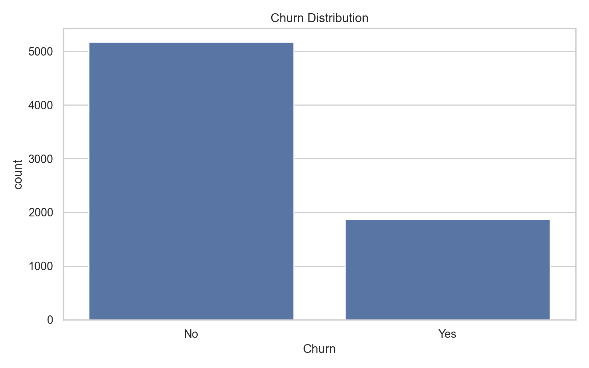
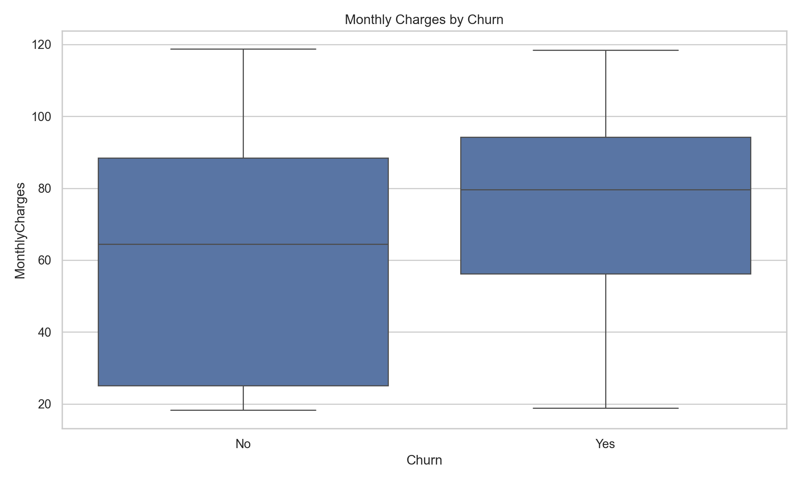
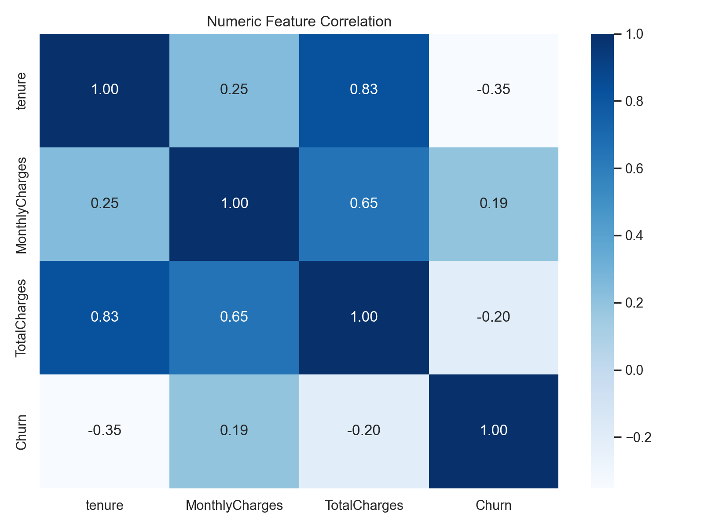
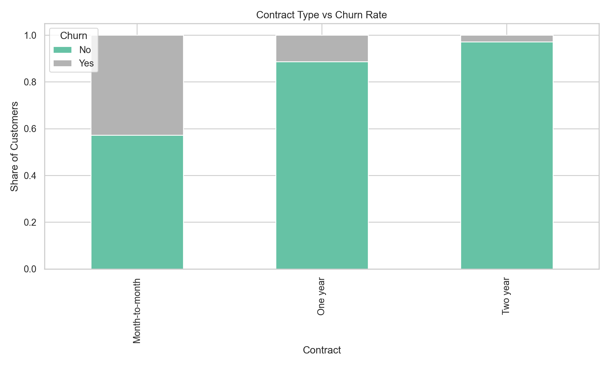
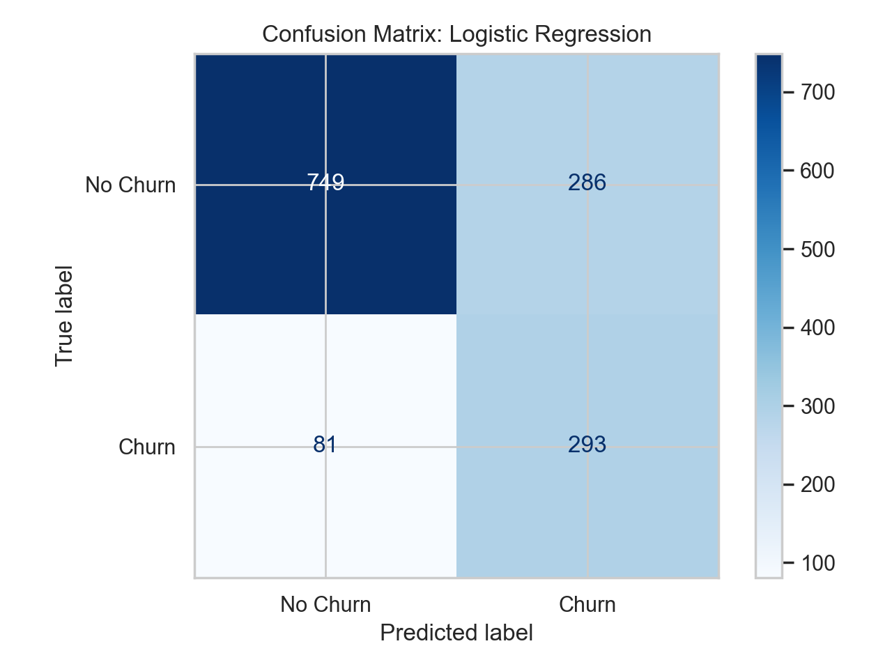

# Customer Churn Classification Project

An end-to-end machine learning project for predicting telecom customer churn using Python, `pandas`, `numpy`, `scikit-learn`, `matplotlib`, and `seaborn`. The project automatically downloads a public dataset, performs exploratory analysis, engineers features, trains multiple classifiers, evaluates them, saves the best model, and runs batch inference.

## Project Overview

This repository demonstrates a complete tabular ML workflow:

- automatic dataset ingestion from a public URL
- data cleaning, missing-value handling, encoding, and scaling
- exploratory data analysis with plots saved to `outputs/`
- domain-inspired feature engineering
- model training with Logistic Regression and Random Forest
- evaluation using accuracy, precision, recall, and F1 score
- model persistence to `models/`
- reproducible inference through `infer.py`

## Dataset Description

- Dataset: IBM-style Telco Customer Churn dataset
- Source: public CSV mirrored at [Giskard examples](https://raw.githubusercontent.com/Giskard-AI/examples/main/datasets/WA_Fn-UseC_-Telco-Customer-Churn.csv)
- Rows: 7,043 customers
- Target: `Churn` (`Yes` or `No`)
- Business question: predict whether a telecom customer is likely to churn based on demographics, services, billing, and contract details

## Project Structure

```text
.
|-- data/
|   |-- raw_telco_churn.csv
|   |-- processed_telco_churn.csv
|-- models/
|   |-- best_model.joblib
|-- notebooks/
|   |-- churn_demo.ipynb
|-- outputs/
|   |-- *.png
|   |-- metrics.json
|   |-- model_comparison.csv
|   |-- sample_predictions.csv
|   |-- sample_inference_predictions.csv
|-- src/
|   |-- config.py
|   |-- data_ingestion.py
|   |-- eda.py
|   |-- evaluation.py
|   |-- features.py
|   |-- infer.py
|   |-- modeling.py
|   |-- pipeline.py
|   |-- preprocessing.py
|   |-- utils.py
|-- infer.py
|-- requirements.txt
|-- README.md
```

## How To Run

1. Install dependencies:

```bash
pip install -r requirements.txt
```

2. Run the full pipeline with one command:

```bash
python -m src
```

3. Run inference on a CSV file:

```bash
python infer.py --input data/sample_inference_input.csv --output outputs/sample_inference_predictions.csv
```

## Pipeline Details

### 1. Data ingestion

`src/data_ingestion.py` downloads the dataset automatically into `data/raw_telco_churn.csv`.

### 2. Preprocessing

`src/preprocessing.py` handles:

- missing numeric values with median imputation
- missing categorical values with most-frequent imputation
- one-hot encoding for categorical variables
- feature scaling for numeric variables

### 3. Feature engineering

`src/features.py` creates additional predictive signals:

- `is_month_to_month`
- `has_fiber_optic`
- `charges_per_tenure`
- `num_addon_services`
- `tenure_group`

### 4. Modeling

`src/modeling.py` trains:

- Logistic Regression
- Random Forest Classifier

### 5. Evaluation

`src/evaluation.py` compares models on a holdout test set and stores:

- metrics in `outputs/metrics.json`
- comparison table in `outputs/model_comparison.csv`
- confusion matrices for both models
- sample predictions in `outputs/sample_predictions.csv`

## Model Performance

The Logistic Regression model achieved the best F1 score and was saved as `models/best_model.joblib`.

| Model | Accuracy | Precision | Recall | F1 Score |
|---|---:|---:|---:|---:|
| Logistic Regression | 0.7395 | 0.5060 | 0.7834 | 0.6149 |
| Random Forest | 0.7970 | 0.6447 | 0.5241 | 0.5782 |

Notes:

- Logistic Regression had the strongest recall and F1 score, which is useful when missing churners is costly.
- Random Forest produced the highest accuracy and precision, but a lower recall on churners.

## Sample Output

Pipeline console output:

```text
Pipeline completed successfully.
Best model: logistic_regression
Metrics saved to: outputs/metrics.json
logistic_regression: {'accuracy': 0.7395, 'precision': 0.506, 'recall': 0.7834, 'f1_score': 0.6149}
random_forest: {'accuracy': 0.797, 'precision': 0.6447, 'recall': 0.5241, 'f1_score': 0.5782}
```

Sample prediction rows:

```text
gender,SeniorCitizen,Partner,Dependents,tenure,...,TotalCharges,predicted_churn,churn_probability
Female,0,Yes,No,1,...,29.85,1,0.8552
Male,0,No,No,34,...,1889.5,0,0.1062
Male,0,No,No,2,...,108.15,1,0.5996
```

## Screenshots Of Results

### Churn distribution



### Monthly charges by churn



### Correlation heatmap



### Contract type vs churn



### Logistic regression confusion matrix



## Notebook Demo

The notebook at `notebooks/churn_demo.ipynb` provides a lightweight walkthrough of loading the processed dataset, reviewing results, and inspecting sample predictions.

## Reproducibility

- Random seed is fixed to `42`
- raw and processed data are stored locally after download
- the best trained model is serialized with `joblib`
- all generated outputs are saved to versionable files
