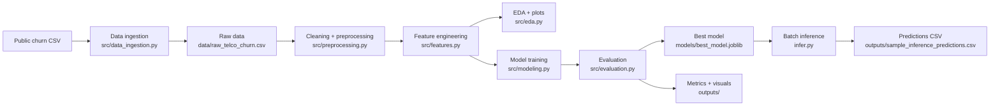
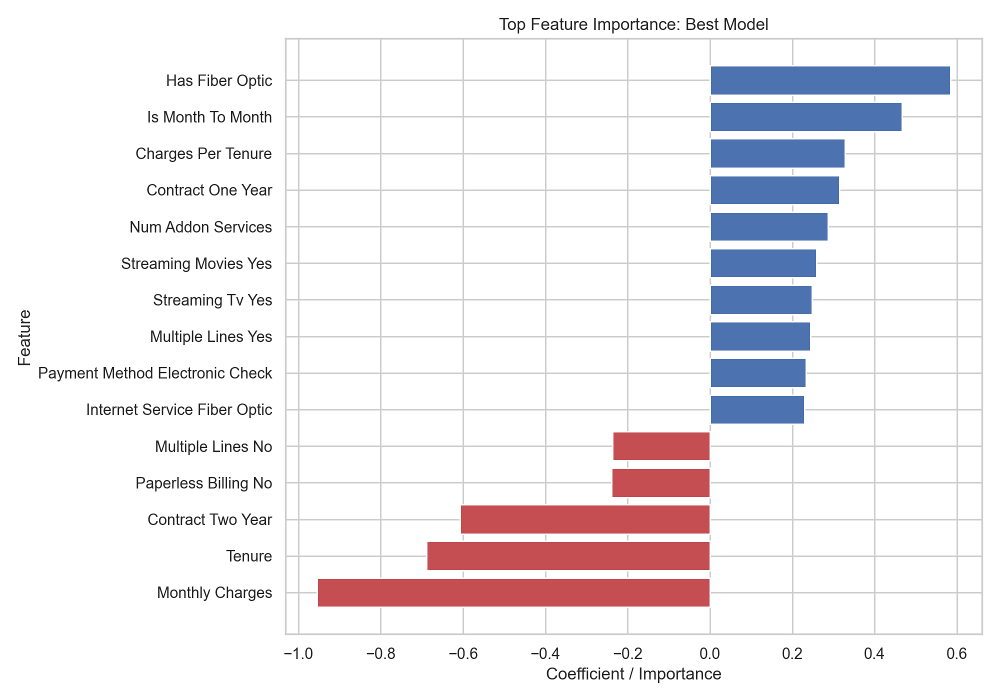

# Customer Churn Classification

An end-to-end machine learning project that predicts telecom customer churn from customer profile, service usage, and billing behavior. The pipeline automatically downloads a public dataset, performs data cleaning and EDA, engineers additional features, trains multiple classifiers, evaluates them on a holdout set, saves the best model, and supports batch inference from the command line.

Repository: [sathya1007-coder/customer-churn-ml-project](https://github.com/sathya1007-coder/customer-churn-ml-project)

## Business Problem

Customer churn directly affects recurring revenue and customer lifetime value. For subscription businesses, identifying customers with a high likelihood of leaving makes it possible to intervene earlier with targeted retention actions such as contract offers, proactive support, or pricing changes.

This project answers a practical business question:

**Can we predict which telecom customers are likely to churn using demographic, contract, service, and billing information?**

The target variable is `Churn`, and the goal is to build a reproducible classification pipeline that can support retention-focused decision making.

## Dataset

- Dataset: IBM-style Telco Customer Churn dataset
- Source: [Public CSV mirror](https://raw.githubusercontent.com/Giskard-AI/examples/main/datasets/WA_Fn-UseC_-Telco-Customer-Churn.csv)
- Records: 7,043 customers
- Target: `Churn` (`Yes`/`No`)

The data includes:

- customer demographics
- subscription and internet service details
- billing and payment behavior
- account tenure and charges

## Approach

The project is organized as a clean, modular ML workflow:

1. **Data ingestion**
   Downloads the dataset automatically into `data/raw_telco_churn.csv`.
2. **Preprocessing**
   Cleans numeric fields, handles missing values, encodes categorical variables, and scales numeric inputs.
3. **EDA**
   Generates reusable visuals into `outputs/` for churn distribution, billing behavior, correlations, and contract patterns.
4. **Feature engineering**
   Adds business-relevant predictors such as:
   - `is_month_to_month`
   - `has_fiber_optic`
   - `charges_per_tenure`
   - `num_addon_services`
   - `tenure_group`
5. **Model training**
   Trains and compares:
   - Logistic Regression
   - Random Forest Classifier
6. **Evaluation**
   Measures model quality using accuracy, precision, recall, and F1 score.
7. **Model persistence**
   Saves the best-performing model to `models/best_model.joblib`.
8. **Inference**
   Scores new rows using `infer.py`.

## Architecture Diagram



## Results

The best model by F1 score was **Logistic Regression**, which is a sensible choice when recall on churners matters more than raw accuracy alone.

| Model | Accuracy | Precision | Recall | F1 Score |
|---|---:|---:|---:|---:|
| Logistic Regression | 0.7395 | 0.5060 | 0.7834 | 0.6149 |
| Random Forest | 0.7970 | 0.6447 | 0.5241 | 0.5782 |

Interpretation:

- **Logistic Regression** found a larger share of actual churners, making it stronger for early retention intervention.
- **Random Forest** achieved higher accuracy and precision, but missed more churners due to lower recall.

Pipeline output:

```text
Pipeline completed successfully.
Best model: logistic_regression
Metrics saved to: outputs/metrics.json
logistic_regression: {'accuracy': 0.7395, 'precision': 0.506, 'recall': 0.7834, 'f1_score': 0.6149}
random_forest: {'accuracy': 0.797, 'precision': 0.6447, 'recall': 0.5241, 'f1_score': 0.5782}
```

Sample inference output:

```text
gender,SeniorCitizen,Partner,Dependents,tenure,...,TotalCharges,predicted_churn,churn_probability
Female,0,Yes,No,1,...,29.85,1,0.8552
Male,0,No,No,34,...,1889.5,0,0.1062
Male,0,No,No,2,...,108.15,1,0.5996
```

## Key Insights

- Customers on **month-to-month contracts** show higher churn risk than longer-term contract customers.
- Customers with **short tenure** and **high monthly charges** are more likely to churn.
- **Fiber optic** subscribers appear frequently among churners, suggesting either pricing pressure or service-experience friction.
- Choosing a model depends on business preference:
  - if the team wants to catch more churners, optimize for recall/F1
  - if the team wants fewer false positives, optimize for precision

## Example Output Visuals

### Churn distribution


### Monthly charges by churn


### Contract type vs churn


### Logistic regression confusion matrix


### Feature importance for the best model



## Project Structure

```text
.
|-- data/
|-- models/
|-- notebooks/
|-- outputs/
|-- src/
|-- infer.py
|-- requirements.txt
|-- README.md
```

Key files:

- `src/pipeline.py`: full end-to-end execution
- `src/data_ingestion.py`: dataset download
- `src/preprocessing.py`: cleaning and preprocessing pipeline
- `src/features.py`: feature engineering
- `src/modeling.py`: train candidate models
- `src/evaluation.py`: metric generation and artifact export
- `src/infer.py`: scoring helper
- `notebooks/churn_demo.ipynb`: lightweight demo notebook

## How To Run

Install dependencies:

```bash
pip install -r requirements.txt
```

Run the full pipeline:

```bash
python -m src
```

Run batch inference:

```bash
python infer.py --input data/sample_inference_input.csv --output outputs/sample_inference_predictions.csv
```

## CLI Usage Examples

Run the full project from scratch:

```bash
python -m src
```

Score a small prepared sample file:

```bash
python infer.py --input data/sample_inference_input.csv --output outputs/sample_inference_predictions.csv
```

Score your own customer file:

```bash
python infer.py --input path/to/new_customers.csv --output outputs/new_customer_predictions.csv
```

Inspect saved metrics after training:

```bash
python -c "import json; print(json.load(open('outputs/metrics.json')))"
```

## Reproducibility

- one-command execution with `python -m src`
- fixed random seed (`42`)
- automatic public dataset download
- saved processed data, plots, metrics, and trained model

## Portfolio Notes

This repository is designed to demonstrate practical ML project skills beyond model fitting:

- modular project structure
- reproducible pipelines
- interpretable evaluation
- business-oriented framing
- GitHub-ready documentation and artifacts

## Future Improvements

- add cross-validation and hyperparameter tuning with `GridSearchCV` or `RandomizedSearchCV`
- introduce model tracking with MLflow or Weights & Biases
- expose the predictor as a lightweight FastAPI service
- add SHAP-based explainability for richer customer-level interpretation
- package the workflow with Docker and CI for easier deployment
